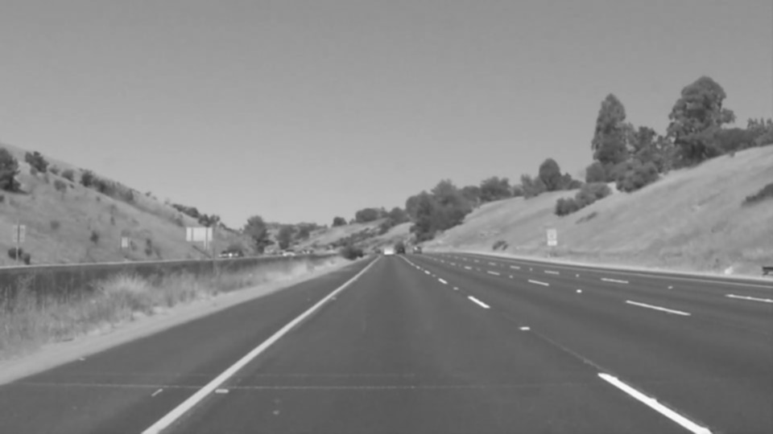
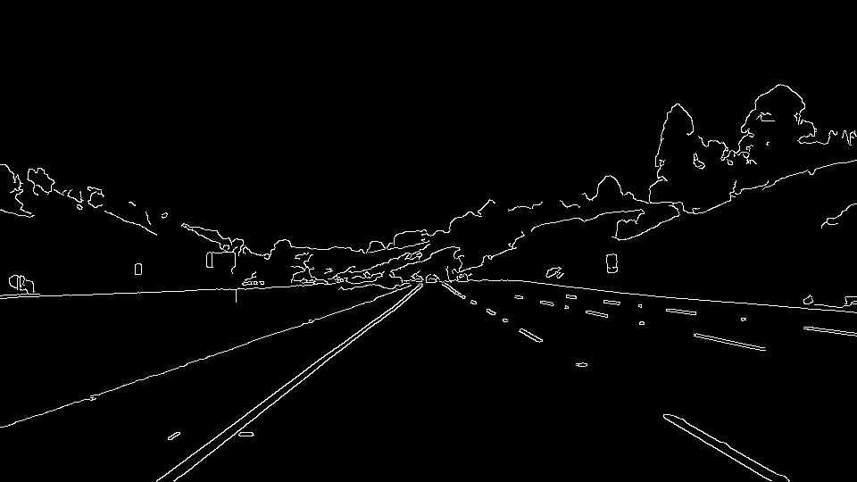
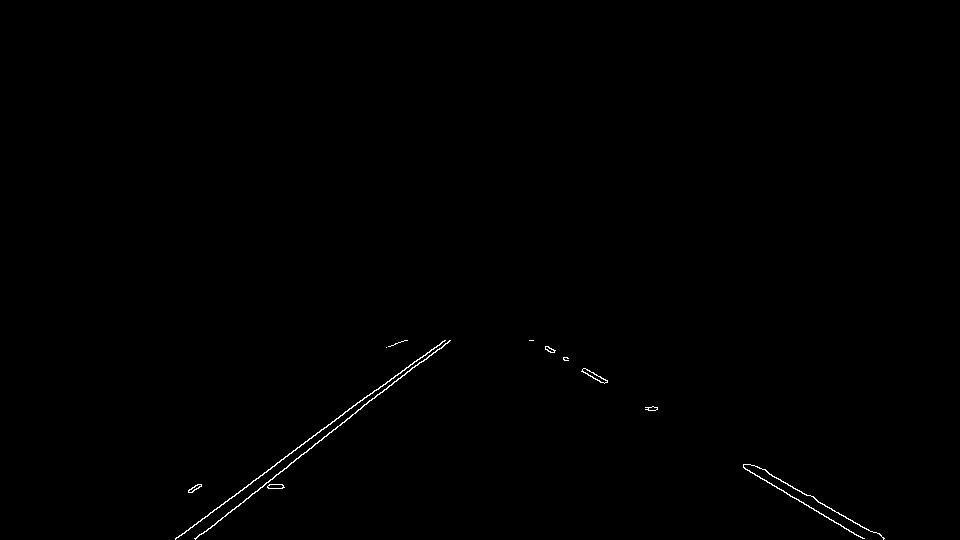
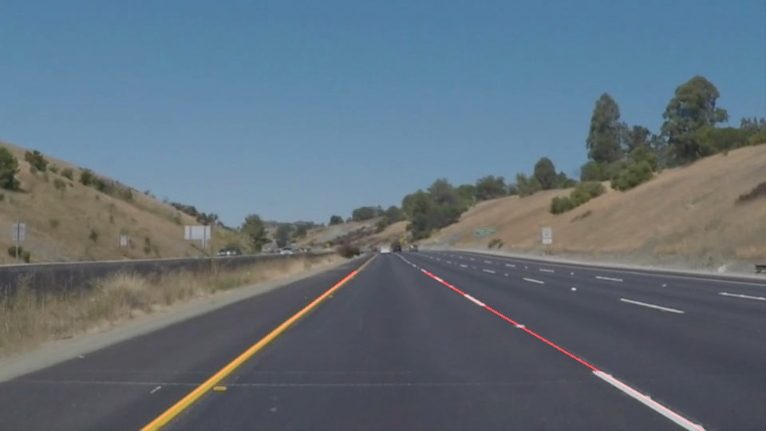

**Finding Lane Lines on the Road** 

---
### Reflection

#### 1. Lane Detection Pipeline

The Lane Detection Pipeline consists of 5 steps:

* **Step 1**: Color convertion of the image from color into gray scale. 
Reasonale: Gray scale images are better suited for edge detection algorithms.
* **Step 2**: Noise reduction of the image using the Gaussian blur algorithm.
*Tuning parameter: **kernel-size** for blur algorithm.* 
* **Step 3**: Detection of edges inside the image using the CANNY algorithm. 
*Tuning parameters: **threshold high**, pixels above this thershold are considered as strong edges;
**threshold low**, pixels below this threshold are rejected.*
* **Step 4**: Identification of lines within the viewing area of lane detection using image masking and the Hough algrithm. 
* Step 4.1: Remove all drawing info which is not part of the viewing area of lane detection.
*Tuning parameters: **xy coordinates** of viewing area of lane detection.*
* Step 4.2: Run Hough algoritm on masked image.
*Tuning parameters: **RHO**, **THETA** unit values;
**Threshold** (vote) specifies the minimum number of intersections (in Hough space) to be accepted as line;
**Min. Length** specifies the minimum line length to be accepted as line;
**Max. Gap** specifies the maximum gap between 2 lines to be connected as single line.*
* **Step 5**: Calculate and draw a single line for the detected right and left lane into new image 
(= original image + lanes highlighted) using the *drawLines* function. The algorithm of the *drawLines*
function is presented below.

 
    FUNCTION drawLines() 
                                
        FOR EACH line(x1,y1)(x2,y2) DO
                        
            calculate slope = (y2-y1)/(x2,x1)
                        
            IF ( slope > 0 AND slope > PositiveSlopeThreshold ) 
            THEN   
                calculate new mean values for RightLaneSlope, RightLane(x1,y1)
                BREAK
             
            IF ( slope < 0 AND slope < NegativeSlopeThreshold ) 
            THEN   
                calculate new mean values for LeftLaneSlope, LeftLane(x1,y1)
                BREAK
                
        END FOR        
                           
        calculate & draw single line for Right Lane 
        using RightLaneSlope, RightLane(x1,y1), ymin, ymax
        
        calculate & draw single line for Left Lane
        using LeftLaneSlope, LeftRightLane(x1,y1), ymin, ymax
        
    END FUNCTION
        
        
   
**Notes**: 
1. The line **slope** for the right lane is positive and negative for the left lane. 
2. **ymin** is the lower and **ymax** is the upper y value of the view area of lane detection. 
3. The **PositiveSlopeThreshold** and **NegativeSlopeThreshold** are used to filter out lines which are almost horizontal.
    

The images below present the output image for each pipeline step.

* Original image 

* Image after pipeline 1 

* Image after pipeline 2 

* Image after pipeline 3 

* Image after pipeline 4.1 

* Result image *

                   

#### 2. Potential shortcomings with current pipeline

The following potentail shortcomings are seen:

* ** 1 - Fix Parameter Set**: The pipeline is setup with a fixed tuning paramter set. 
This could be an issue if environment conditions change, i.e. from sunshine to rain.
*Possible problem: Lanes could not be detected.* 

The following improvements versus the shortcomings of the previous section are seen:

* ** 1 - Fix Parameter Set**: 
The parameter set of the pipeline could be changed versus the environment conditions.
*Realization: Different parameter set profiles are defined versus different environment conditions, i.e.
one profile for sunshine, one profile for rain etc. The trigger for changing the parameter set (profile) could be
done by a light sensor inside the car.*
* ** 2 - Twisty Lanes or lanes with difficult bends**: 
The lane detection algorithm could use a non-linear interpolation algorithm in order to better detect non-linear lanes.
*Realization: Use non-linear interpolation algorithm.*
* ** 3 - Line interpolation Algorithm of drawLines function**: 
The line algorithm of the drawLines function could use a more sufficiated linearization algorithm which better interpolates.
*Realization: Use a sufficiated linearization algorithm*
* ** 4 - Code of pipeline**: 
The code of the pipeline needs to be optimized versus coding-style, performance, memory consumption and robustness.
*Realization: Code reviews and optimizations. Create a class covering the full pipeline.*
tens-macbook-air:CarND-LaneLines-P1 Carsten$ vi 
**Finding Lane Lines on the Road** 

---
### Reflection

#### 1. Lane Detection Pipeline

The Lane Detection Pipeline consists of 5 steps:

* **Step 1**: Color convertion of the image from color into gray scale. 
Reasonale: Gray scale images are better suited for edge detection algorithms.
